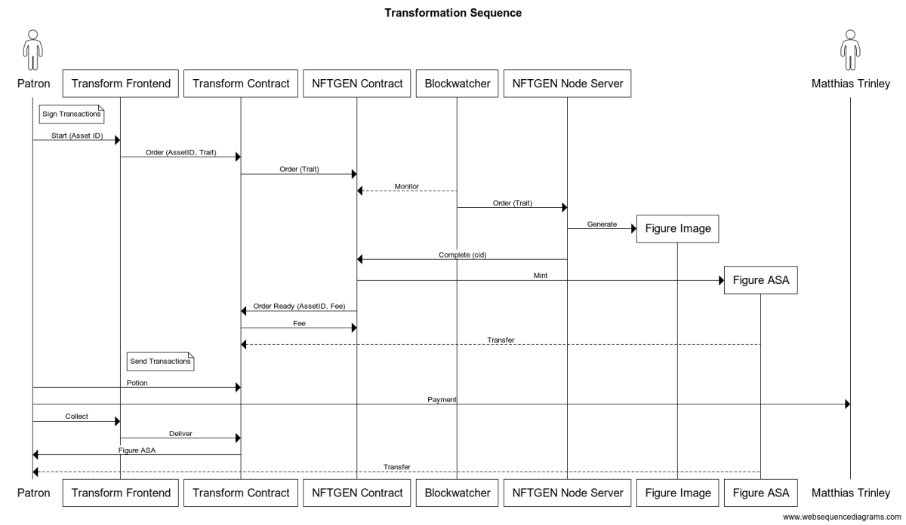

# Trinley Transformation Technical Description

## System Components

(Some minor simplifications and names changed for clarity)

|Logical Part|Name|Type|Environment/VM Type| Description|
|----------|-------------|---------------|---------|-----------|
|Front End |`figures.html`   |HTML/JavaScript|Browser  |Store web page where users purchase and receive their figure transformation.|
|Front End |`trinley.py`  |Smart Contract |AVM      |Smart contract used by `figures.html` to track user order state and send orders to `nftgen.py`. |
|Back End  |`nftgen.py`  |Smart Contract | AVM |Smart contract that receives the orders and fulfills them by minting and transferring to `trinley.py`. |
|Back End | `watcher` | Shell/JavaScript|bash/Node.js|Watches for calls to `nftgen.py` contract, generates with `char-gen` and then fulfills the order using `nftgen.py`|
|Back End | `char-gen` | JavaScript | Docker (Sysbox): Node.js | |

<!-- |Back End  |algonfts.mjs|JavaScript   |Node.js|       |         |   | -->

